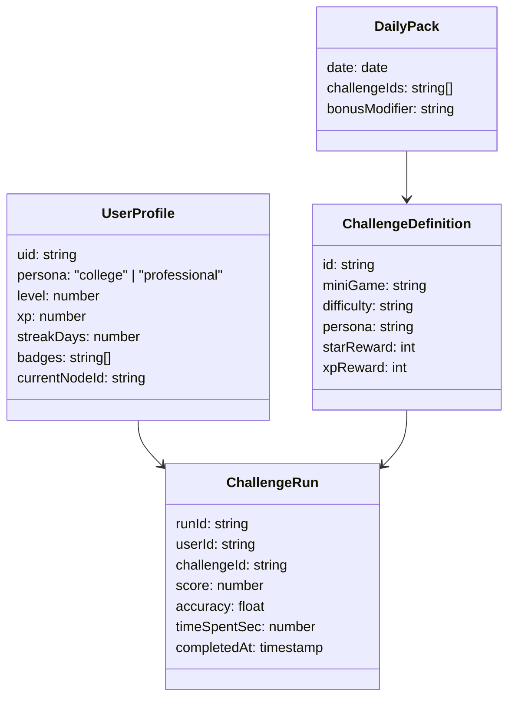

# MathQuest MVP Design

## 1. Guiding Vision
- **Tagline:** "A fun, gamified math learning adventure where users solve puzzles, unlock levels, and earn rewards—making math addictive like a game."
- **Core Philosophy:**
  - **Engagement First:** Learning emerges through play, discovery, and narrative-driven challenges.
  - **Short Bursts:** Every activity is scoped to 5–15 minutes, balancing quick wins with depth.
  - **Personal Relevance:** Content branches into college and professional tracks, framing math around exam preparation, workplace analytics, and financial decisions.

## 2. Target Personas & Motivations
| Persona | Goals | Motivations | Pain Points | Hooks |
| --- | --- | --- | --- | --- |
| **College Challenger** (18–24) | Ace math-heavy courses, prep for exams or internships | Wants interactive practice, friendly competition | Textbooks feel dull, lacks time | Fast-paced daily challenges, social leaderboards, streak rewards |
| **Pro Strategist** (25+) | Apply math in careers (finance, tech, ops), keep skills sharp | Values real-world context, micro-learning | Hard to fit study into schedule, wants ROI | Scenario-based simulations, progress analytics, tangible badges |

## 3. Experience Pillars
1. **Adventure Layer:** A map-based journey (e.g., Probability Forest → Algebra Mountain → Calculus Skyway) visually tracks progress. Every node is a challenge cluster with story beats and micro-animations.
2. **Challenge Loop:** Users tackle short game-like puzzles, rack up points, and unlock the next node.
3. **Personalized Pathing:** Onboarding puzzle calibrates skill and unlocks relevant storyline arcs (college vs. pro scenarios).
4. **Reward Ecosystem:** Points, streaks, badges, surprise "Eureka" easter eggs, and seasonal leaderboards maintain momentum.

## 4. Core MVP Features
### 4.1 Interactive Onboarding Adventure
- Narrative intro by **Astra**, a friendly Math Mentor avatar.
- Players solve a three-stage puzzle sequence (pattern recognition, equation balance, real-world estimation) to "activate" their Math Orb.
- Performance unlocks one of three starting tracks (Foundation, Intermediate, Pro). Unlock message references user context (exam prep vs. workplace simulation).

### 4.2 Lessons as Games
- **Mini-game templates:**
  - **Equation Forge:** Drag & drop numbers/operators to complete equations.
  - **Probability Pathways:** Interactive tree visual where players predict outcomes.
  - **Geometry Shift:** Rotate and fit shapes to satisfy constraints.
  - **Boss Battles:** Timed gauntlets with trick questions and combo multipliers.
- Each mini-game features:
  - 3 escalating rounds (1–3 minutes each).
  - Micro-animations for correct moves (particle effects, celebratory avatar reactions).
  - Haptic pulses and sound stingers for major milestones.

### 4.3 Daily Challenge Loop
- Daily pack of 3–5 challenges curated by difficulty and user focus.
- "Beat the Clock" mode: solve as many puzzles as possible in 5 minutes for bonus streak XP.
- Completion yields streak progression, XP, and a random loot card (cosmetic avatar gear, power-ups like "Hint Spark").

### 4.4 Progress Map & Narrative
- Board-game style path with checkpoints:
  - **Probability Forest** → **Algebra Mountain** → **Statistics Harbor** → **Optimization Citadel**.
- Each checkpoint includes:
  - Entry cutscene (static illustration + text) relating to persona goals.
  - Cluster of 4–6 mini-games + 1 boss battle.
  - Unlock condition: earn ≥ 12 stars within previous node.
- Surprise detours (Easter Egg caves) appear after streak milestones, delivering bonus content and cosmetic rewards.

### 4.5 Rewards & Social Layer
- **Points & XP:** Earned per puzzle; combo multiplier for consecutive correct answers.
- **Badges:** e.g., "Forest Explorer" (complete all Probability Forest challenges), "Speed Solver" (perfect 5-min sprint).
- **Streak System:** Daily login + challenge completion extends streak; missing a day triggers a "rescue mission" mini-challenge to save streak.
- **Leaderboards:** Weekly leaderboards segmented by persona; optional team mode for study groups/work cohorts.

### 4.6 Real-World Scenario Modules
- **College Track Examples:**
  - Plan an exam study schedule using probability and optimization.
  - Analyze grading curves and expected value of retaking quizzes.
- **Professional Track Examples:**
  - Simulate investment portfolio risk via Monte Carlo-style mini-game.
  - Optimize logistics route costs using linear programming puzzles.

## 5. User Journey (5–15 Minute Sessions)
1. **Launch:** Astra greets user, highlights streak status, surfaces daily challenge pack.
2. **Choice Moment:** User selects Daily Challenge, continues map node, or explores surprise puzzle.
3. **Play Burst:** Completes 2–3 mini-games (3 minutes each) or one boss battle.
4. **Reward Ceremony:** Points, badge progress, streak animation, map progression.
5. **Personal Reflection:** Quick stat card (accuracy, time, suggested next challenge).

## 6. Content Structure
- Stored as JSON for rapid iteration.
```json
{
  "id": "probability_forest_01",
  "persona": "college",
  "miniGame": "ProbabilityPathways",
  "context": "Plan your exam schedule",
  "narrative": {
    "setup": "Midterms are coming up!", 
    "goal": "Allocate study hours to maximize pass probability."
  },
  "rounds": [
    {
      "prompt": "Drag topics into your 5-day planner to achieve 85% pass likelihood.",
      "timeLimit": 180,
      "data": {"topics": ["Calculus", "Linear Algebra", "Statistics"], "hours": 20},
      "successCriteria": "score >= 75"
    }
  ],
  "rewards": {
    "xp": 150,
    "stars": 3,
    "loot": "HintSpark"
  }
}
```
- Modular templates for equation puzzles, geometry manipulations, timed quizzes.

## 7. Gamification & Progression Logic
- **XP Curve:** XP required to level up follows mild exponential growth (Level XP = 500 * level^1.2).
- **Unlocks:**
  - New map zones unlock at level thresholds or star counts.
  - Avatar cosmetics unlocked at streak milestones (7, 14, 30 days).
- **Easter Eggs:** Hidden nodes triggered by perfect streak weeks; contain experimental puzzles and unique badges.
- **Boss Mechanics:** 5-question timed challenge; scoring uses combo multipliers and accuracy bonus.

## 8. Feedback & Immersion
- **Micro-animations:** Lottie animations for fireworks, avatar emotes, map transitions.
- **Audio:** Layered sound design (soft background loop, success chimes, tension build-up in boss battles).
- **Haptics:** Light taps for correct actions, stronger pulses for boss victories (mobile devices only).
- **Mentor Guidance:** Astra delivers tips using adaptive messaging based on previous mistakes.

## 9. Technical Architecture (MVP Scope)
- **Frontend:** React Native app with Expo, sharing component library with responsive web via React Native Web.
- **UI Styling:** Tailwind (with `nativewind`) + Framer Motion (or `moti`) for animations.
- **State Management:** Zustand or Redux Toolkit for game state; React Query for server sync.
- **Backend:**
  - Firebase Authentication (email, social logins).
  - Firestore for user profiles, progress, leaderboards.
  - Cloud Functions for streak resets, daily challenge rotation.
- **Content Delivery:** Static JSON stored in Firebase Storage / CDN, cached locally.
- **Analytics:** Firebase Analytics + custom events (session length, streak status, challenge completion rate).

## 10. Sample Data Model


## 11. Roadmap (0–3 Months)
| Sprint | Focus | Deliverables |
| --- | --- | --- |
| 0 | Foundations | Design system, avatar concept, JSON content schema |
| 1 | Onboarding MVP | Interactive puzzle onboarding, persona selection, initial data capture |
| 2 | Core Mini-games | Equation Forge + Probability Pathways modules, reward animations |
| 3 | Progress Map | Map UI with unlock logic, streak system, daily challenges |
| 4 | Scenario Packs | College & professional scenario modules, analytics instrumentation |
| 5 | Polish & Beta | Audio/haptics, leaderboards, closed beta feedback |

## 12. Success Metrics & Analytics
- **Engagement:** Average daily session ≥ 10 min, weekly retention ≥ 45%.
- **Learning Impact:** Challenge completion rate ≥ 70%, accuracy improvements week-over-week.
- **Motivation:** Streak participation (users with streak ≥7 days) ≥ 60% of active users.
- **Qualitative:** In-app NPS ≥ +25, user feedback mentions "fun" or "game" descriptors.

## 13. Future Enhancements
- Community quests (co-op boss battles).
- AR-enhanced geometry puzzles.
- Integrations with LMS / professional certification platforms.
- Adaptive difficulty powered by Bayesian mastery modeling.

## 14. Appendices
- **Sound & Haptic Guidelines:** Keep celebratory audio ≤ 1.5s, ensure haptics optional in settings.
- **Accessibility Considerations:** Colorblind-safe palettes, adjustable text size, captioned audio cues.

